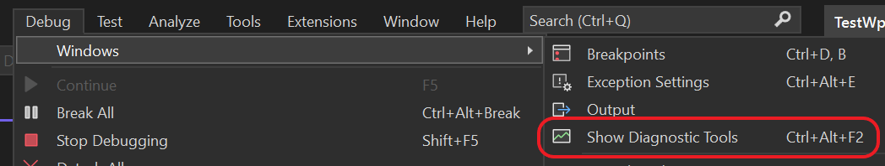
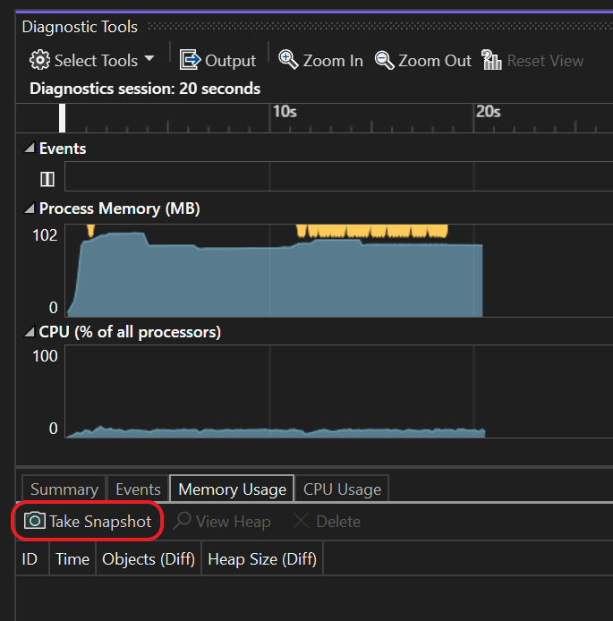
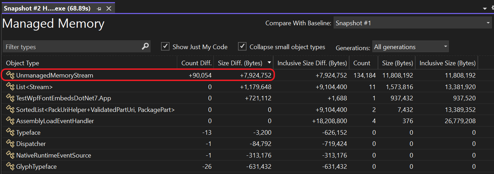

# WPF Font Embed Leak Demonstration

This is a simple example project to demonstrate a memory leak in WPF embedded
font handling, as reported in [this issue][1].

The project is configured to use .NET 7.0, but the issue is also reproducible in
.NET Framework 4.8.

## Reproduction instructions

1. Open `TestWpfFontEmbedsDotNet7.sln` in Visual Studio.

2. Build and run the project's `Debug` configuration.

3. Enable Visual Studio's **Diagnostic Tools** window (**Debug** > **Windows** >
   **Show Diagnostic Tools**):

   

4. Wait approximately 10 seconds after the app starts for the **Process Memory**
   graph to stabilise, then on the **Memory Usage** tab press the
   **Take Snapshot** button:

   

5. Wait a minute or so, then take another snapshot.

6. In the **Heap Size (Diff)** column, click the diff size link to open the
   snapshot (the previous snapshot will automatically be selected as the
   baseline in the top right corner):

   

7. Sort the results by **Size Diff. (bytes)**; you'll see that the
   **UnmanagedMemoryStream** entry grows without bound:

   

Note that the issue does *not* affect fonts with resource type set to
**Content** (although demonstrating that fact requires some refactoring of the
main loop).

  [1]: https://github.com/dotnet/wpf/issues/7289